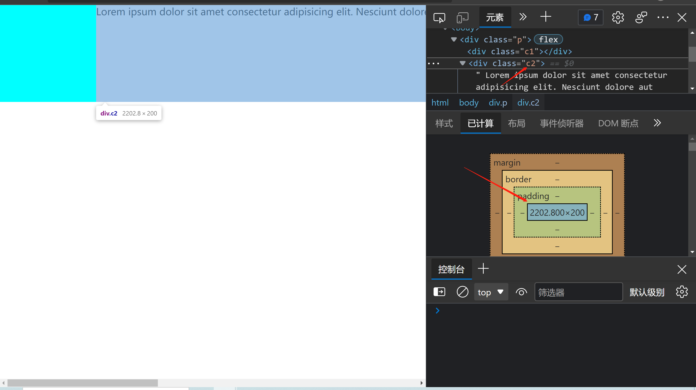
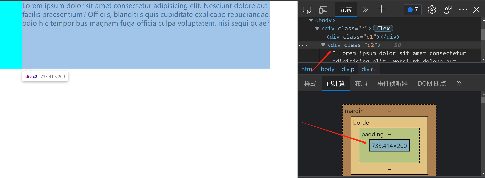

#### flex-shrink 引发的问题

考虑有以下代码:

```html
<!DOCTYPE html>
<html lang="en">
  <head>
    <meta charset="UTF-8" />
    <meta http-equiv="X-UA-Compatible" content="IE=edge" />
    <meta name="viewport" content="width=device-width, initial-scale=1.0" />
    <title>Document</title>
    <style>
      * {
        margin: 0;
        padding: 0;
        box-sizing: border-box;
      }
      .p {
        display: flex;
        width: 800px;
        height: 200px;
      }
      .c1 {
        height: 200px;
        flex-basis: 200px;
        background-color: cyan;
      }
      .c2 {
        white-space: nowrap;
      }
    </style>
  </head>
  <body>
    <div class="p">
      <div class="c1"></div>
      <div class="c2">
        Lorem ipsum dolor sit amet consectetur adipisicing elit. Nesciunt dolore
        aut facilis praesentium? Officiis, blanditiis quis cupiditate explicabo
        repudiandae, odio hic temporibus magnam fuga officia culpa voluptatem,
        nisi sequi quae?
      </div>
    </div>
  </body>
</html>
```

很简单，一个容器`div.p`,宽度为 800px,display 为`flex`,里面有两个子元素分别为`div.c1`和`div.c2`,那么此时的结果是什么呢？

很容易这么想:总宽度 800px,然后 div.c1 占据了 200px，div.c2 设置了`flex-grow:1`,那么结果就是 div.c2 占据剩下的 600px 就行了.

现实打脸:


什么，div.c1 的宽度居然变成 0 了，我们不是给他设置了`flex-basis:200px`吗？div.c2 的宽度过大，从而出现了滚动条,他不是应该只占 600px 吗？

经过搜索，发现了两个相关的回答:

[how-is-a-flex-childs-100-width-calculated](https://stackoverflow.com/questions/62959299/how-is-a-flex-childs-100-width-calculated)

[why-dont-flex-items-shrink-past-content-size](https://stackoverflow.com/questions/36247140/why-dont-flex-items-shrink-past-content-size)

先看第一个链接，讲述了假如 flex-item 的宽度是怎么确定的，

> We first set the initial width of each element
>
> If the total width is bigger that the container width, we shrink both elements
>
> The shrink factor consider the negative free space (total width - container width) and the width of each element.

其中最重要的一点，就是第一点，确定每个 flex-item 的初始大小,该怎么做呢? 答案是给每个 flex-item 设置`flex-shrink:0`

```css
.c1 {
  flex-shrink: 0;
}
.c2 {
  flex-shrink: 0;
}
```

结果:



现在，div.c1 宽 200px, div.c2 宽约 2200px, 那么 2200 / 200 = 11 , div.c2 的宽度是 div.c1 的 11 倍,容器的宽度为 800px, 一共超出了( 200 + 2200 - 800 = 1600)px,而我们之前的 c1 和 c2 都没设置 flex-shrink,那么就是默认值 1，此时 div.c1 的宽度应该为( 200 - 1 / 12 \* 1600 = 66.6667)px,而 div.c2 的宽度应该为( 2200 - 11 / 12 \* 1600 = 733.3333)px, 按理说应该如此啊，为什么一开始的结果确为 div.c1 的宽度为 0,而 div.c2 的宽度保持为 2200px 呢？

答案就在第二个链接里，

> A flex item cannot be smaller than the size of its content along the main axis.

大概就是说 flex-item 的宽度不能比它的内容的宽度还小，而 div.c1 没有内容，div.c2 的内容就是里面的那些字,其宽度就是 flex-shrink:0 时表现的那样，为 2200px, 所以，本来 c1 和 c2 都应该缩小，但是 div.c2 的宽度又不能小于 2200px,那么对不起了，c1 你来缩小吧，此时就变成 0 了(存疑)

而且上面的链接还说了，这个宽度不能比内容小的限制是可以解除的，通过两种方式:

> min-width: 0
>
> overflow: hidden (or any other value, except visible)

我们来验证一下，

```css
.c1 {
  flex-shrink: 1;
}
.c2 {
  flex-shrink: 1;
  min-width: 0;
}
```

结果如下:


看见了吗？此时 div.c2 的宽度是 733px,和我们上面推算的结果一致，而我们设置了`white-space:nowrap`,所以文字超出了 div.c2.假如查看 div.c1 的话，你会发现宽度是 66px，也和我们上面推算的结果一致，

完整代码:

```html
<!DOCTYPE html>
<html lang="en">
  <head>
    <meta charset="UTF-8" />
    <meta http-equiv="X-UA-Compatible" content="IE=edge" />
    <meta name="viewport" content="width=device-width, initial-scale=1.0" />
    <title>Document</title>
    <style>
      * {
        margin: 0;
        padding: 0;
        box-sizing: border-box;
      }
      .p {
        display: flex;
        width: 800px;
        height: 200px;
      }
      .c1 {
        height: 200px;
        flex-basis: 200px;
        background-color: cyan;
      }
      .c2 {
        min-width: 0;
      }
    </style>
  </head>
  <body>
    <div class="p">
      <div class="c1"></div>
      <div class="c2">
        Lorem ipsum dolor sit amet consectetur adipisicing elit. Nesciunt dolore
        aut facilis praesentium? Officiis, blanditiis quis cupiditate explicabo
        repudiandae, odio hic temporibus magnam fuga officia culpa voluptatem,
        nisi sequi quae?
      </div>
    </div>
  </body>
</html>
```

结果是:



我们来推理一下为什么是这个结果，先给 c1 和 c2 设置:

```css
.c1,
.c2 {
  flex-shrink: 0;
}
```

结果如下：


显而易见，div.c1 宽度 200,div.c2 宽度为 2200

然后就可以根据上面的推理 flex-item 的宽度的方法，得到最终的结果是 div.c1 宽度是 66px 和 div.c2 的宽度是 733px,

总结:

先给 flex-item 设置`flex-shrink:0`,以确定初始值,然后给各 item 设置`min-width:0`或者是`overflow:hidden`，最后就能得到预想的结果

PS: 为什么在最初的例子里面我要加上`white-space:nowrap`呢？好像和此文主题没什么关系啊，确实如此，通过上面的例子可以看到，不管是否有`white-space:nowrap`,我们在设置`flex-shrink:0`之后，文字都没有折行，都是一行，此时 div.c2 的宽度都是 2200px，只是在最后的表现上，假如加上`white-space:nowrap`的话，文字会超出 div.c2，不加的话就自动折行了

##### 验证

我们可以通过把文字换成图片来推理一下结果:

代码如下:

```html
<!DOCTYPE html>
<html lang="en">
  <head>
    <meta charset="UTF-8" />
    <meta http-equiv="X-UA-Compatible" content="IE=edge" />
    <meta name="viewport" content="width=device-width, initial-scale=1.0" />
    <title>Document</title>
    <style>
      * {
        margin: 0;
        padding: 0;
        box-sizing: border-box;
      }
      .p {
        display: flex;
        width: 800px;
        height: 200px;
      }
      .c1 {
        height: 200px;
        flex-basis: 200px;
        background-color: cyan;
      }
      .c2 {
      }
    </style>
  </head>
  <body>
    <div class="p">
      <div class="c1"></div>
      <div class="c2">
        
      </div>
    </div>
  </body>
</html>
```

我们将文字换为 1200x200 的占位图，效果会是怎样？

效果如下:


是的，div.c1 宽度又变成 0 了,div.c2 宽度为 1200px,也就是图片的宽度.

我们把 div.c1 和 div.c2 的 flex-shrink 设置为 0 来确定初始的宽度:

```css
.c1,
.c2 {
  flex-shrink: 0;
}
```

此时 div.c1 宽为 200px，div.c2 宽为 1200px

我们给 div.c2 设置`min-width:0`,同时删除上面的`flex-shrink:0`的代码

```css
/* .c1,
.c2 {
  flex-shrink: 0;
} */
.c2 {
  min-width: 0;
}
```

那么我们来计算宽度

div.c1

200 - 1 / 7 \* 600 = 114

div.c2

1200 - 6 / 7 \* 600 = 685

效果如下:


如我们推算的一样，只是此时图片太大了，超出了 div.c2 的宽度，我们只需要给图片设置`max-width:100%`,就能把图片塞进 div.c2 了.


PS: 写到这里的时候，对比一下图片和文字在这里面的表现，我们在做宽度计算时设置`flex-shrink:0`后，仿佛 div.c2 的宽度无限大，所以此时文字是一行，并未折行，图片也就是自己的宽度.图片和文字都像是在完全伸展自己，然后我们再由此得到 div.c2 的初始宽度.完成推算以后，此时文字如果不设置`white-space:nowrap`的话，就自动换行了，图片不设置`max-width:100%`或者其他宽度设置的话，就可能超出 div.c2.
